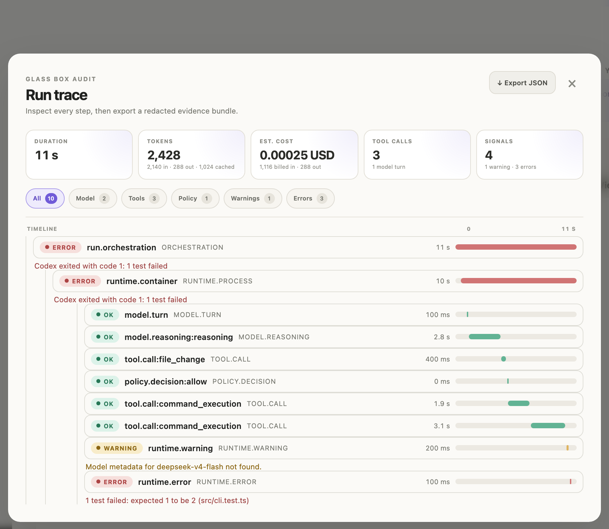
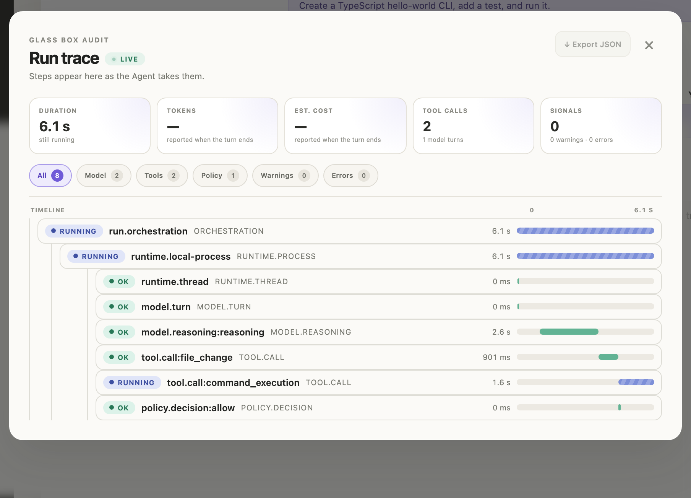
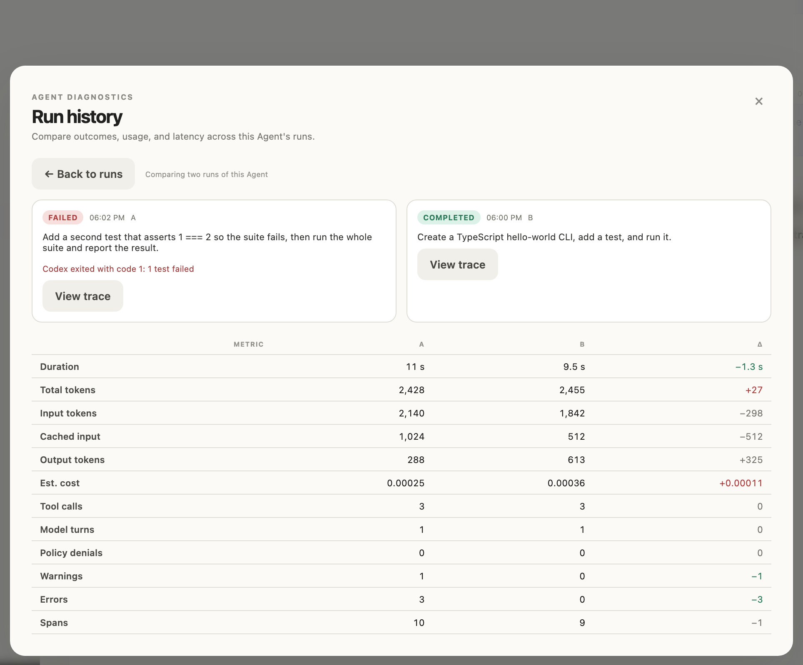
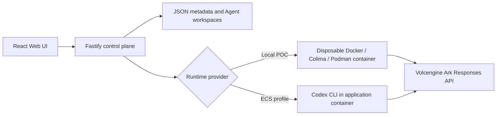

# Volc Agent Launchpad

A minimal Agent platform for three-day middleware hackathons. It provides Agent
CRUD, a browser Playground, persistent workspaces, and Codex CLI backed by the
Volcengine Ark Responses API.

Run it locally with Docker, Colima, or rootless Podman, or deploy it to
Volcengine ECS.

> [!WARNING]
> This is a single-user proof of concept. It intentionally has no identity or
> hardened sandbox middleware. Do not use production data or credentials.
> See [SECURITY.md](SECURITY.md).

## Team-designed middleware: Glass Box trace and audit

> **Selected track: A — The Glass Box (Trace and Audit).** One track, end to
> end. The policy layer described below is not an entry in Track C: it exists
> because a decision the platform makes about a Run is part of that Run's
> trace, and it is judged as trace evidence, not as a sandbox.

**The problem.** The Starter Kit records the *result* of an Agent Run — status,
output, error — and nothing about how it got there. Codex reasons, runs
commands, and edits files across many steps inside a disposable container whose
stdout is parsed for one final message and then discarded. When a Run fails, the
operator sees `Codex exited with code 1: boom` and cannot tell which step
failed, what the Agent had already changed, or what the Run cost.

**The capability.** Every Run emits a correlated, redacted trace — a tree of
spans covering the Run, the Runtime invocation, and each Codex item, with
`item.started`/`item.completed` paired so a step carries its real duration — plus
a versioned, re-redacted **audit bundle** that can leave the machine as
evidence. The root span is persisted before the Runtime is invoked, so a Run
that is still executing, or one interrupted by a crash, still has a trace.

**Where it runs.** `AgentService.executeRun` (Fastify control plane) owns the
trace; `apps/server/src/trace.ts` classifies and redacts it; `audit.ts`
summarises it; `GET /api/runs/:id/trace` and `GET /api/runs/:id/audit` serve it
behind the same auth hook as every other route.

**While it runs.** Spans are persisted as the events arrive, so **Watch trace
live** shows each step the moment the Agent takes it, with the open step's bar
growing against the timeline. The trace is not a post-mortem.

**In the browser.** The span tree carries a proportional timeline bar per span
on one shared axis, stat cards (duration, tokens in/out/cached, estimated cost,
tool calls and model turns, warnings and errors), and count-badged filters that
keep the tree connected. **Runs** lists history with status filter, search, and
sorting, and compares any two Runs side by side with a delta column.
**Export JSON** downloads the redacted audit bundle.

**What the platform decided.** Commands are evaluated as they are observed, and
a denial removes the container mid-turn. Every evaluation — allow and deny —
becomes a `policy.decision` span with `actorType: system`, so the trace shows
that the check ran and what it concluded rather than leaving its absence
ambiguous.

**No Ark credentials?** `npm run demo:seed` loads a fixture Agent with one
successful and one failing Run, so the middleware is inspectable without a model
endpoint.

**Start here:**
[docs/ONE_PAGE_ARCHITECTURE.md](docs/ONE_PAGE_ARCHITECTURE.md) is the one-page
diagram — data flow, trust boundaries, and the numbered instrumentation,
enforcement, and recovery points.
[docs/GLASS_BOX.md](docs/GLASS_BOX.md) has the problem statement, design, span
lifecycle and crash recovery, retention policy, a three-minute demo script, the
automated-evidence map, and known limitations.

## Screenshots

### Run trace — the team's middleware

A failing Run of the seeded fixture Agent: stat cards, count-badged filters, and
the span tree with a proportional timeline. The failing step and its diagnostic
sit at the end of the axis, and the successful steps before it show exactly what
the Agent had already changed.



### The same view, mid-Run

`Live`, with the running step's bar still growing and usage marked as not yet
reported. Steps appear as the Agent takes them; export stays disabled until the
Run is terminal, because a half-finished bundle is not evidence.



### Run comparison



### Provided baseline: Agent Playground

The Starter Kit's own screens, unchanged.


### Provided baseline: Create an Agent


## Features

- React and TypeScript Web UI
- Agent create, edit, start, stop, delete, and multi-turn chat
- Fastify control plane with asynchronous Run state
- Persistent Agent workspaces and Codex sessions
- Disposable Docker, Colima, or Podman container for each local turn
- Docker and Terraform deployment paths for Volcengine ECS

## Requirements

- Node.js 22+
- npm 10+
- Docker, Colima, or Podman
- A Volcengine Ark API key and endpoint that supports the Responses API

Codex CLI is included in the Runtime image and is not required on the host.

## Local browser SOP

### 1. Check the local tools

Install Node.js 22+ and one supported container engine, then verify them:

```bash
node --version
npm --version
docker --version        # Docker Desktop, Docker Engine, or Colima
podman --version        # Use this instead when running Podman
```

Only one container engine is required. Codex CLI is already included in the
Runtime image.

### 2. Clone the repository

```bash
git clone <repository-url> volc-agent-launchpad
cd volc-agent-launchpad
```

Skip this step when already working from the repository root.

### 3. Start the POC

```bash
ARK_API_KEY=your-ark-api-key \
ARK_MODEL=ep-your-endpoint-id \
npm run poc
```

The first run installs Node.js dependencies and builds the Runtime image. The
script automatically selects Docker, Colima, or Podman.

### 4. Open the browser

Visit <http://localhost:3000>, or open it from the terminal:

```bash
open http://localhost:3000       # macOS
xdg-open http://localhost:3000   # Linux desktop
```

In the Web UI:

1. Select **Create Agent**.
2. Enter a name, description, and workspace instructions.
3. Select **Create Agent** again.
4. Enter a task in the Playground, for example:

   ```text
   Create a TypeScript hello-world CLI, add a test, and run it.
   ```

The Agent can write files, run commands, and continue the same Codex session in
later messages.

Open **Runs** to compare status, duration, and token usage across historical
runs. From **View trace**, filter model/tool/warning/error spans or use
**Export JSON** to download a redacted audit bundle for the selected run.

### 5. Stop and resume

Press `Ctrl+C` in the startup terminal. The script removes temporary Runtime
containers but keeps Agent workspaces and conversations.

- macOS state: `~/.volc-agent-launchpad/`
- Linux state: `.local/`
- Custom location: set `LOCAL_POC_DATA_ROOT`

Run the same `npm run poc` command to continue later.

### Select a specific container engine

Force Podman when multiple engines are installed:

```bash
CONTAINER_ENGINE=podman \
ARK_API_KEY=your-ark-api-key \
ARK_MODEL=ep-your-endpoint-id \
npm run poc
```

Colima uses `CONTAINER_ENGINE=docker` because it exposes the Docker CLI.

For a clean Linux host, follow the
[rootless Podman setup](docs/LOCAL_POC.md#rootless-podman-on-linux).

## Docker Compose

Create and edit the configuration:

```bash
./scripts/bootstrap-local.sh
```

Required values in `.env`:

```dotenv
ARK_API_KEY=your-ark-api-key
ARK_MODEL=ep-your-endpoint-id
APP_AUTH_TOKEN=replace-with-at-least-24-random-characters
```

Start the application:

```bash
docker compose up --build
```

Open <http://localhost:3000>. Stop it without deleting Agent data:

```bash
docker compose down
```

## Development

```bash
npm install
cp .env.example .env
npm install --global @openai/codex@0.111.0
npm run dev
```

- Web UI: <http://localhost:5173>
- API: <http://localhost:3000>

Use local paths in `.env` when running outside Docker:

```dotenv
APP_DATA_DIR=.data
AGENT_WORKSPACE_ROOT=workspaces
CODEX_HOME=codex-home
```

## Deployment

- [Existing Linux ECS with Docker](docs/DEPLOYMENT.md#existing-linux-ecs)
- [Complete Volcengine environment with Terraform](docs/DEPLOYMENT.md#terraform-deployment)
- [Local Docker, Colima, and Podman details](docs/LOCAL_POC.md)

The existing-ECS script deploys from the current source tree:

```bash
cp .env.example .env.production
./scripts/deploy-existing-ecs.sh .env.production
```

The Terraform path provisions VPC, subnet, security group, ECS, and EIP:

```bash
cp deploy/volcengine/terraform.tfvars.example \
  deploy/volcengine/terraform.tfvars
./scripts/deploy-volcengine.sh
```

## Configuration

| Variable | Default | Purpose |
| --- | --- | --- |
| `ARK_API_KEY` | Required | Ark model API key. |
| `ARK_MODEL` | Required | Responses-capable endpoint or model ID. |
| `ARK_BASE_URL` | Beijing v3 endpoint | Ark OpenAI-compatible API URL. |
| `APP_AUTH_TOKEN` | Empty on loopback | Shared demo token; use 24+ random characters remotely. |
| `RUNTIME_PROVIDER` | `local-process` | `container` for disposable local Runtime containers. |
| `CODEX_SANDBOX_MODE` | `workspace-write` | Codex inner sandbox mode. |
| `CODEX_TIMEOUT_MS` | `600000` | Maximum duration of one turn. |
| `POLICY_ENABLED` | `true` | Evaluate and enforce Runtime command policy. |
| `POLICY_RULES` | Built-in | JSON array overriding the built-in deny rules. |
| `TRACE_MAX_EVENT_SPANS_PER_RUN` | `500` | Event spans kept per Run before older ones are dropped. |
| `TRACE_RETENTION_RUNS` | `200` | Runs whose traces are retained, oldest dropped whole. |
| `TRACE_COST_INPUT_PER_MTOK` | `0` | Price per million uncached input tokens; `0` reports no cost rather than a false zero. |
| `TRACE_COST_CACHED_INPUT_PER_MTOK` | `0` | Price per million cached input tokens. |
| `TRACE_COST_OUTPUT_PER_MTOK` | `0` | Price per million output tokens. |
| `TRACE_COST_CURRENCY` | `USD` | Label on the cost estimate; no conversion is performed. |
| `LOCAL_POC_DATA_ROOT` | Platform-specific | Local metadata, workspace, and session directory. |

See [.env.example](.env.example) for all Runtime and resource-limit options.

## How it works



The first turn uses `codex exec`; later turns resume the stored Codex thread.
Deleting an Agent archives its workspace under `workspaces/.deleted/`.

See [docs/ARCHITECTURE.md](docs/ARCHITECTURE.md) for component and extension
boundaries.

## Validation

```bash
npm run check
```

Typecheck, both test suites, and the production build. It runs on
every push through [.github/workflows/check.yml](.github/workflows/check.yml).

```bash
npm run verify:evidence
```

The middleware's own acceptance test. It seeds a throwaway store, serves it,
exports every audit bundle over the real HTTP route, and checks each one:
schema version, one connected span tree with no orphans or cycles, durations
that agree with their timestamps, no span left open on a terminal Run, and no
credential-shaped string anywhere in the file. It then restarts the server with
a token configured and confirms an unauthenticated export is refused.

To check a bundle you exported from the browser:

```bash
npm run verify:audit -- ~/Downloads/agentlens-run-<id>-audit.json
```

The verifier restates its redaction patterns independently of
`apps/server/src/trace.ts` on purpose: a checker that shares code with the
producer cannot catch a bug in the shared code.

```bash
terraform fmt -check -recursive deploy/volcengine
docker compose config
```

## Known limitations

Of the Glass Box middleware specifically — the Starter Kit's own limits are in
[SECURITY.md](SECURITY.md), and the full list with reasoning is in
[docs/GLASS_BOX.md](docs/GLASS_BOX.md#limitations).

- **The live view polls once a second rather than streaming.** A step can be up
  to a second old on screen, and each poll re-serialises the whole Run. SSE
  would fix both; polling reuses the existing authenticated route and adds no
  new transport to the trust boundary.
- **The timeline is one bar per span, not a flame graph.** No tracks, zoom, or
  brush, so on a Run with hundreds of spans short steps all render at the
  minimum width.
- **Redaction is pattern matching.** It covers the configured Ark key plus the
  credential shapes listed in the docs. A secret in an unlisted shape, or one
  encoded before being printed, would not be recognised.
- **Cost is an estimate at operator-supplied rates.** Nothing validates them
  against a price list, and a Run that reported no usage is unpriced rather
  than free.
- **Policy enforcement is a denylist over command text, applied at
  `item.started`.** It is evasion-resistant only against the obvious, and it
  detects-then-terminates rather than approving before execution.
- **Single user, no identity.** Every caller shares one bearer token; the trace
  records which Agent acted, not which person asked. That is Track B's problem.
- **The JSON store rewrites the whole file per mutation.** Fine for a POC,
  wrong for concurrent Agents at volume.

## Documentation

- [One-page architecture diagram](docs/ONE_PAGE_ARCHITECTURE.md)
- [Glass Box middleware: problem, design, demo, and limitations](docs/GLASS_BOX.md)
- [Architecture](docs/ARCHITECTURE.md)
- [Local POC](docs/LOCAL_POC.md)
- [Deployment](docs/DEPLOYMENT.md)
- [Hackathon extension guide](docs/HACKATHON_EXTENSION_GUIDE.md)
- [Security policy](SECURITY.md)
- [Contributing](CONTRIBUTING.md)

## License

[MIT](LICENSE)
