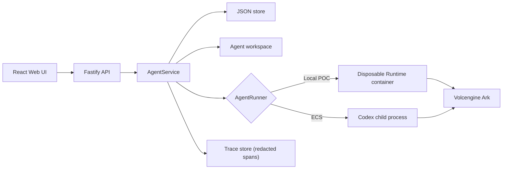
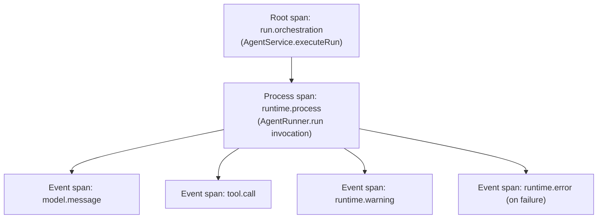

# Architecture

Volc Agent Launchpad is a single-node control plane for hackathon use.



## Components

### Web UI

Lists Agents, manages lifecycle actions, submits prompts, and polls asynchronous
Runs. It never receives the Ark API key.

### Fastify API

Validates requests, protects remote demos with a shared bearer token, and
serves the compiled Web UI. The token is not user identity or authorization.

### AgentService

Coordinates lifecycle state, persistence, workspaces, and Runs. One Agent can
have only one active Run.

```text
ready -> busy -> ready
  |       |
  v       v
stopped  error
```

Interrupted Runs become `cancelled` after a restart.

### Storage

```text
data/launchpad.json       Agent, message, and Run metadata
workspaces/AgentID/       Agent-created files
workspaces/.deleted/      Archived deleted workspaces
codex-home/               Codex configuration and sessions
```

`JsonStore` serializes writes and atomically replaces one JSON file. It supports
one process only.

### Runtime providers

- `CodexRunner` runs Codex inside the application container for ECS.
- `ContainerCodexRunner` starts one disposable Docker, Colima, or Podman
  container for every local turn.

Both providers use argv-only process execution, bound output and time, resume
the stored Codex thread, and escalate termination after a grace period.

## Deployment profiles

| Profile | Control plane | Agent execution |
| --- | --- | --- |
| Local POC | Host Node.js | Disposable local container |
| ECS | Application container | Codex process in the same container |
| Local development | Host Node.js | Host Codex process |

## Extension seams

| Track | Primary seam | Expected change |
| --- | --- | --- |
| Glass Box | `AgentRunner`, `AgentRun` | Implemented: correlated execution events, see Observability below. |
| Bouncer | API routes, Agent ownership | Add identity and server-side authorization. |
| Kill Switch | `AgentRunner` | Add threat-specific policy or a stronger sandbox. |

The current container or ECS instance is the POC trust boundary. Ordinary
containers are not hardened multi-tenant isolation.

## Observability (Glass Box track)

Every Run produces a correlated tree of `TraceSpan` records, persisted in the
same JSON store as Agents, messages, and Runs (`apps/server/src/trace.ts`,
`apps/server/src/types.ts`).



- **Root span** (`category: orchestration`) covers the whole Run, closed
  `ok`/`error`/`cancelled` alongside the existing `AgentRun.status`
  transition.
- **Process span** (`category: runtime.process`) covers one
  `AgentRunner.run()` invocation; carries sandbox mode, runtime provider,
  and (for the container Runtime) the container engine — never the Ark key.
- **Event spans** are derived from the Codex CLI's `--json` event stream,
  captured verbatim in `codex-runner.ts`/`container-codex-runner.ts` and
  shaped into spans by `trace.ts`. Category is inferred from the event's
  `item.type`; known non-fatal runtime diagnostics are classified as warnings,
  and unrecognized types fall back to `unknown.<type>` rather than being
  dropped. Matching `item.started`/`item.completed` records are combined so
  their span carries the actual step duration. If a runner fails, its captured
  event stream and partial usage are retained and written before the Run is
  closed, preserving the evidence needed to diagnose the failure.

**Trust boundary and redaction.** `trace.ts`'s `redactSecrets` strips the
configured Ark API key and any `Bearer <token>` pattern from every span
attribute and error message before it is written to disk, and truncates
oversized strings. The Ark key itself is only ever handed to the Runtime as
an environment variable (`childEnvironment()` in both runners) — it is never
part of a Codex JSON event line, so it cannot flow into a span in the first
place; the string-match redaction is defense in depth. `GET
/api/runs/:id/trace` sits behind the same bearer-auth boundary as every
other `/api/*` route.

View the latest Run's trace from the Playground via **View trace**, or open
**Runs** to inspect any historical Run and its trace. Trace access is available
once a Run reaches a terminal state (`completed`, `failed`, or `cancelled`).
The Run history view can filter and sort outcomes, prompts, duration, and token
usage. `GET /api/runs/:id/audit` builds a versioned JSON evidence bundle with
the redacted Run, correlated spans, duration, usage, and diagnostic counts.
The export path applies redaction again at serialization time as defense in
depth and never includes Agent instructions or workspace paths.
