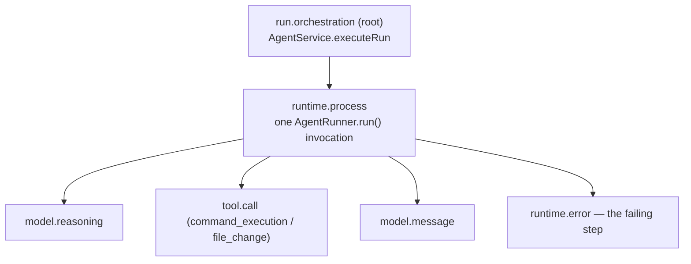

# Glass Box: trace and audit middleware

This is the middleware capability this team designed on top of the Agent
Launchpad Starter Kit. It is the document to read alongside the code.

For the single-page view of the same design — data flow, trust boundaries, and
the numbered instrumentation, enforcement, and recovery points — see
[ONE_PAGE_ARCHITECTURE.md](ONE_PAGE_ARCHITECTURE.md).

## The problem

The Starter Kit records the *result* of an Agent Run — a status, an output
string, and an error string — and nothing about how the Run got there. Codex
CLI reasons, executes commands, and edits files across many steps inside a
disposable container whose stdout is parsed for one final message and then
discarded. When a Run fails, the operator sees `Codex exited with code 1:
boom` and has no way to answer the questions that matter:

- Which step failed, and what had the Agent already done to the workspace
  before it failed?
- How long did each step take, and how many tokens did the Run cost?
- Which Runtime, sandbox mode, and container engine actually executed it?

This is Agent-specific: a Run is not one request, it is an autonomous
multi-step process whose intermediate actions have real side effects on a
persistent workspace. Treating it as an opaque request/response is what makes
an Agent platform unoperable.

## The capability

Every Run now emits a correlated, redacted **trace** — a tree of `TraceSpan`
records persisted next to Agents, messages, and Runs, and queryable at
`GET /api/runs/:id/trace`.



| Span | Category | Owns |
| --- | --- | --- |
| Root | `orchestration` | The whole Run: status, wall-clock duration, terminal error. |
| Process | `runtime.process` | One Runtime invocation: sandbox mode, runtime provider, container engine, token usage. |
| Event | `model.*`, `tool.call`, `runtime.error`, `unknown.*` | One Codex CLI item, with its redacted payload as span attributes. |

Event spans pair Codex's `item.started` and `item.completed` for the same item
id into a **single** span: the `started` event opens it as `running`, the
`completed` event closes it with a real duration and the authoritative payload.
A tool call is therefore visible *while it is still executing*, not only after
it returns. A `completed` event with no matching `started` remains a zero-width
point span.

## Boundary and ownership

- **Who owns the decision.** `AgentService.executeRun` (the control plane) owns
  the trace. It **persists** the root span as `running` before the Runtime is
  invoked, streams event spans as Codex emits them, and closes every span in the
  *same* `store.mutate` transaction that transitions `AgentRun.status`. A Run
  can therefore never reach a terminal state without its trace being written,
  and a Run that is still executing is already observable.
- **The control plane, not the runner, owns what was observed.** Events arrive
  through an `onEvent` callback on `RunnerRequest`; `AgentService` records them
  itself and treats its own record as authoritative at finalisation, falling
  back to `RunnerResult.events` only for a runner that does not stream. A
  runner cannot silently erase a trace by reporting no events.
- **What crosses the boundary.** The `AgentRunner` interface stays thin: a
  runner returns `RunnerResult.events` (raw Codex JSON lines plus an observation
  timestamp) and knows nothing about spans. Shaping raw events into spans lives
  entirely in `apps/server/src/trace.ts`. A new runner gains tracing by
  populating `events`; nothing else changes.
- **What happens on failure.** Runners attach the events they had already
  observed to the thrown error (`attachRunnerEvents` in `errors.ts`), so a
  failed or cancelled Run still produces the full step-by-step trace up to the
  failure rather than only the two enclosing spans. This is what makes "locate
  the failing step" work in practice.
- **Trace ingestion never fails a Run.** Span construction is pure and
  synchronous; if the Codex event stream contains a type the mapper does not
  recognize, it is stored as `unknown.<type>` instead of being dropped or
  throwing. Streamed writes are batched every 750 ms rather than one store
  write per event, and a failed flush is swallowed so instrumentation can never
  take down the Run it is instrumenting.

## Span lifecycle and crash recovery

A span is written twice: open, then closed.

| Phase | Root span | Process span | Event spans |
| --- | --- | --- | --- |
| Run accepted | `running`, `completedAt: null` | — | — |
| Runtime invoked | `running` | `running` | published as observed; an open item is `running` |
| Item completes | `running` | `running` | its span closes with a real duration |
| Terminal state | `ok` / `error` / `cancelled` | same | replaced by the authoritative capped set |
| Process killed mid-Run | `cancelled` on restart | `cancelled` on restart | retained as observed |

Each flush rebuilds the event-span set from every event seen so far and swaps
it in, rather than appending deltas — an `item.started` span has to be able to
*close* when its `item.completed` arrives in a later batch, which an
append-only stream cannot express. Stopping the stream drains the buffer rather
than discarding it, because Codex emits much of its event burst in the last
moments of a turn.

If the server dies mid-Run, `initialize()` force-cancels the orphaned Run *and*
closes every span still marked `running`, stamping
`"Server restarted while this run was active"`. Without that, an interrupted Run
would either show no trace at all or leave spans `running` forever — which is
precisely the failure an observability capability exists to explain.

## Redaction and trust boundary

`redactSecrets` runs before anything is written to disk. It strips, in order:

1. every configured secret (the Ark API key) by exact match;
2. credential *shapes* the process was never told about — `Bearer` and `Basic`
   authorization headers, `sk-`, `ghp_`/`gho_`/`ghs_`/`github_pat_`, `xoxb-`,
   `AIza`, AWS `AKIA`/`ASIA` key IDs, PEM private-key blocks including their
   body, and the value of any `*password`/`*secret`/`*api_key`/`*token`
   assignment (the name is kept, the value is not);
3. anything left over the length budget for the active capture level.

Step 2 matters because the Agent can *discover* a credential inside its own
workspace and echo it to stdout, where exact-match redaction against the Ark key
would never see it.

Redaction is applied to:

- every span attribute, recursively through nested objects and arrays;
- every span error message;
- `AgentRun.error` and `Agent.lastError`, which are surfaced in the UI and API.

The Ark key reaches the Runtime only as a process environment variable
(`childEnvironment()` in both runners) and is never part of a Codex JSON event,
so string-match redaction is defence in depth rather than the only control.
`GET /api/runs/:id/trace` sits behind the same bearer-auth hook as every other
`/api/*` route.

## Retention

Traces are bounded on two axes so one Agent cannot exhaust the JSON store:

| Control | Default | Behaviour |
| --- | --- | --- |
| `TRACE_CAPTURE_LEVEL` | `full` | `summary` clips every payload string to 256 characters, so a `file_change` event cannot carry a whole file into the trace store. |
| `TRACE_MAX_EVENT_SPANS_PER_RUN` | 500 | Keeps the most recent events for a Run (the failing step is normally at the tail) and records the dropped count in a `trace.truncated` span. |
| `TRACE_RETENTION_RUNS` | 200 | Keeps the newest N Runs, discarding older Runs **whole**, so a retained trace is never left with half its tree missing. |

Deleting an Agent deletes its spans along with its Runs and messages, matching
the existing workspace-archival policy.

## Demo script (three minutes)

The failure case below is deliberately an **Agent-caused failure**, not a
platform misconfiguration. Breaking `ARK_MODEL` would fail the Run before the
Agent does any work, producing a two-span trace that demonstrates nothing. The
point of this middleware is finding a failing step *among real work*, so the
demo has to produce real work first.

1. **Baseline.** `npm run poc`, open <http://localhost:3000>, create an Agent,
   and show its `ready` lifecycle state.
2. **Normal case.** Send `Create a TypeScript hello-world CLI, add a test, and
   run it.` Wait for the Run to complete — a real model call, real file writes,
   and a real command execution inside the disposable container.
3. **Live evidence.** While the Run is still going, select **View trace**: the
   root and process spans are already `running` and event spans stream in as
   Codex works. This is the trace being written, not a report assembled
   afterwards.
4. **Completed evidence.** Once the Run finishes, reopen the trace. Walk the
   tree: root → process → individual `tool.call` and `model.message` spans.
   Point out duration, token total, sandbox mode, and container engine in the
   summary bar. Expand a `tool.call` span to show the redacted payload.
5. **Failure case.** Send `Add a second test that asserts 1 === 2 so the suite
   fails, then run the whole suite and report the result.` The Agent reasons,
   edits a file, runs the suite, and the command exits non-zero — a Run that
   fails *after* doing real work.
6. **Locate the failing step.** Open the trace and press **Failing steps** to
   filter to `status: error`. The failing `command_execution` is isolated out of
   a dozen successful steps, carrying its redacted stderr — while the preceding
   `file_change` spans still show exactly what the Agent changed before it
   broke.
7. **Still controllable.** Close the trace, open **Run history**, filter by
   `failed`, and confirm the Agent returns to `ready` and accepts a new task.
   Press **Export JSON** to hand the trace to an external tool.

**No Ark credentials?** Run `npm run demo:seed` and restart. It loads two
finished Runs — one successful, one failing mid-execution — so every step above
except 3 and 5 can be shown without a model endpoint. See
[Seeded demo data](#seeded-demo-data).

## Seeded demo data

`npm run demo:seed` writes a fixture Agent with two complete traces into the
configured `APP_DATA_DIR`, so a reviewer can inspect the middleware without a
BytePlus ModelArk key. It refuses to overwrite a store that already holds
Agents unless `--force` is passed.

```bash
npm run demo:seed          # seed into the default .data/ store
npm run demo:seed -- --force   # replace an existing store
```

The fixture contains a successful Run (reasoning → file writes → passing
command) and a failing Run (reasoning → file write → failing command → error),
including a span whose payload carries planted secrets already replaced with
`[REDACTED]`, so redaction is visible in the seeded data too.

## Automated evidence

| Behaviour | Test |
| --- | --- |
| Correlated trace for a successful Run | `agent-service.test.ts` — "records a correlated, successful trace" |
| Failing step is identifiable | `agent-service.test.ts` — "identifies the failing step" |
| Pre-failure steps survive a failure | `agent-service.test.ts` — "keeps the steps observed before a failure" |
| Secrets never reach the stored Run/Agent error | `agent-service.test.ts` — "redacts the Ark key and bearer tokens" |
| Spans are deleted with their Agent | `agent-service.test.ts` — "removes an Agent's spans" |
| Redaction across nested payloads, arrays, and batches | `trace.test.ts` — `redactSecrets`, `redactAttributes`, `buildEventSpans` |
| Event cap and Run-level retention | `trace.test.ts` — "event span capping", `pruneSpans` |
| Trace is readable while a Run executes | `agent-service.test.ts` — "exposes an open trace while the Run is still executing" |
| Streamed spans are not duplicated at finalisation | `agent-service.test.ts` — "does not duplicate spans that were streamed" |
| A streaming runner reporting no events keeps its trace | `agent-service.test.ts` — "keeps streamed spans when the runner reports no events" |
| started/completed pair into one span with a real duration | `trace.test.ts` — "item.started / item.completed pairing" |
| An in-flight tool call is visible as `running` mid-turn | `agent-service.test.ts` — "shows an in-flight tool call as a running span" |
| Events arriving in the last flush window are not lost | `agent-service.test.ts` — "publishes events that arrive inside the final flush window" |
| Crash leaves no span stuck open | `agent-service.test.ts` — "closes spans left open by a crash when the server restarts" |
| Unconfigured credential shapes are redacted | `trace.test.ts` — "credential pattern redaction" |
| Capture level bounds stored payloads | `trace.test.ts` — "capture level" |

Run everything with `npm run check`.

## Limitations

- **Streaming is batched, not real-time.** Event spans are flushed every 750 ms
  to avoid rewriting the whole JSON store per event, and the browser polls the
  trace every 1.2 s, so the live view lags a Run by up to ~2 s. A push transport
  (SSE or WebSocket) would remove both delays; the span model does not change.
- **How much there is to watch depends on the task.** Liveness comes from
  Codex's `item.started` events. A turn that spends 30 s in a single model call
  before doing anything shows only the open Run and process spans for those
  30 s — correct, but sparse. Tasks that run several commands produce a visibly
  filling timeline.
- **The assistant reply itself is not streamed.** The trace streams, the answer
  does not: `RunnerResult.output` is taken from the last completed
  `agent_message` when the Codex process exits, and the assistant message row is
  written once, at Run completion. Token-level streaming would need a transport
  from the control plane to the browser (SSE) plus delta handling in the runner;
  it is orthogonal to this middleware.
- **Single-process JSON store.** Inherited from the Starter Kit. Spans share
  its one-process, whole-file-rewrite limitation; a real deployment would send
  spans to an OTLP collector instead. The span shape (id, parent, category,
  status, timings, attributes) maps onto OpenTelemetry deliberately.
- **Event timestamps are observation times.** `observedAt` is when the control
  plane read the JSON line, not when Codex emitted it, so durations carry the
  control plane's scheduling jitter (single-digit milliseconds in practice).
  Item types Codex reports only on completion have no `started` event to pair
  with and remain zero-width point spans.
- **Redaction is pattern-matching.** It covers configured secrets plus the
  credential shapes listed above. A secret in a shape not on that list, or one
  that is base64/hex-encoded before being printed, would not be recognized.
  `TRACE_CAPTURE_LEVEL=summary` is the blunt mitigation: it clips payloads
  before they can carry much of anything.
- **No trace-level access control.** The POC is single-user; trace access is the
  same shared bearer token as the rest of the API. Per-principal trace
  authorization belongs with an identity capability, which this team did not
  build.
