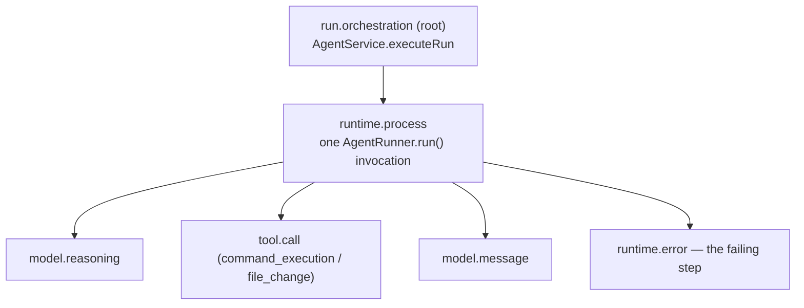

# Glass Box: trace and audit middleware

This is the middleware capability this team designed on top of the Agent
Launchpad Starter Kit. It is the document to read alongside the code.

## The problem

The Starter Kit records the *result* of an Agent Run — a status, an output
string, and an error string — and nothing about how the Run got there. Codex
CLI reasons, executes commands, and edits files across many steps inside a
disposable container whose stdout is parsed for one final message and then
discarded. When a Run fails, the operator sees `Codex exited with code 1:
boom` and has no way to answer the questions that matter:

- Which step failed, and what had the Agent already done to the workspace
  before it failed?
- How long did each step take, and how many tokens did the Run cost?
- Which Runtime, sandbox mode, and container engine actually executed it?

This is Agent-specific: a Run is not one request, it is an autonomous
multi-step process whose intermediate actions have real side effects on a
persistent workspace. Treating it as an opaque request/response is what makes
an Agent platform unoperable.

## The capability

Every Run now emits a correlated, redacted **trace** — a tree of `TraceSpan`
records persisted next to Agents, messages, and Runs, and queryable at
`GET /api/runs/:id/trace`.

| Span | Category | Owns |
| --- | --- | --- |
| Root | `orchestration` | The whole Run: status, wall-clock duration, terminal error. |
| Process | `runtime.process` | One Runtime invocation: sandbox mode, runtime provider, container engine, token usage. |
| Event | `model.*`, `tool.call`, `runtime.error`, `unknown.*` | One Codex CLI JSON event, with its redacted payload as span attributes. |

## Boundary and ownership

- **Who owns the decision.** `AgentService.executeRun` (the control plane) owns
  the trace. It opens the root span before the Runtime is invoked and closes it
  in both the success and failure paths, in the *same* `store.mutate`
  transaction that transitions `AgentRun.status`. A Run can therefore never
  reach a terminal state without its trace being written.
- **What crosses the boundary.** The `AgentRunner` interface stays thin: a
  runner returns `RunnerResult.events` (raw Codex JSON lines plus an observation
  timestamp) and knows nothing about spans. Shaping raw events into spans lives
  entirely in `apps/server/src/trace.ts`. A new runner gains tracing by
  populating `events`; nothing else changes.
- **What happens on failure.** Runners attach the events they had already
  observed to the thrown error (`attachRunnerEvents` in `errors.ts`), so a
  failed or cancelled Run still produces the full step-by-step trace up to the
  failure rather than only the two enclosing spans. This is what makes "locate
  the failing step" work in practice.
- **Trace ingestion never fails a Run.** Span construction is pure and
  synchronous; if the Codex event stream contains a type the mapper does not
  recognize, it is stored as `unknown.<type>` instead of being dropped or
  throwing.

## Redaction and trust boundary

`redactSecrets` strips the configured Ark API key and any `Bearer <token>`
pattern, and truncates oversized strings, before anything is written to disk.
It is applied to:

- every span attribute, recursively through nested objects and arrays;
- every span error message;
- `AgentRun.error` and `Agent.lastError`, which are surfaced in the UI and API.

The Ark key reaches the Runtime only as a process environment variable
(`childEnvironment()` in both runners) and is never part of a Codex JSON event,
so string-match redaction is defence in depth rather than the only control.
`GET /api/runs/:id/trace` sits behind the same bearer-auth hook as every other
`/api/*` route.

## Retention

Traces are bounded on two axes so one Agent cannot exhaust the JSON store:

| Control | Default | Behaviour |
| --- | --- | --- |
| `TRACE_MAX_EVENT_SPANS_PER_RUN` | 500 | Keeps the most recent events for a Run (the failing step is normally at the tail) and records the dropped count in a `trace.truncated` span. |
| `TRACE_RETENTION_RUNS` | 200 | Keeps the newest N Runs, discarding older Runs **whole**, so a retained trace is never left with half its tree missing. |

Deleting an Agent deletes its spans along with its Runs and messages, matching
the existing workspace-archival policy.

## Demo script (three minutes)

1. **Baseline.** `npm run poc`, open <http://localhost:3000>, create an Agent,
   and show its `ready` lifecycle state.
2. **Normal case.** Send `Create a TypeScript hello-world CLI, add a test, and
   run it.` Wait for the Run to complete — a real model call, real file writes,
   and a real command execution inside the disposable container.
3. **Evidence.** Select **View trace**. Walk the tree: root → process →
   individual `tool.call` and `model.message` spans. Point out the duration,
   token total, sandbox mode, and container engine in the summary bar. Expand a
   `tool.call` span to show the redacted payload.
4. **Failure case.** Stop the Ark endpoint or set an invalid `ARK_MODEL`, then
   send another task. The Run fails.
5. **Locate the failing step.** Open the trace, press **Failing steps** to
   filter to `status: error`, and show that the failing span carries the
   redacted Codex error while the preceding steps are still visible.
6. **Still controllable.** Close the trace, open **Run history**, filter by
   `failed`, and confirm the Agent returns to `ready` and accepts a new task.
   Optionally press **Export JSON** to hand the trace to an external tool.

## Automated evidence

| Behaviour | Test |
| --- | --- |
| Correlated trace for a successful Run | `agent-service.test.ts` — "records a correlated, successful trace" |
| Failing step is identifiable | `agent-service.test.ts` — "identifies the failing step" |
| Pre-failure steps survive a failure | `agent-service.test.ts` — "keeps the steps observed before a failure" |
| Secrets never reach the stored Run/Agent error | `agent-service.test.ts` — "redacts the Ark key and bearer tokens" |
| Spans are deleted with their Agent | `agent-service.test.ts` — "removes an Agent's spans" |
| Redaction across nested payloads, arrays, and batches | `trace.test.ts` — `redactSecrets`, `redactAttributes`, `buildEventSpans` |
| Event cap and Run-level retention | `trace.test.ts` — "event span capping", `pruneSpans` |

Run everything with `npm run check`.

## Limitations

- **Trace is written at Run completion, not streamed.** Spans for a Run appear
  once it reaches a terminal state; there is no live trace during a running
  turn. The span model already supports streaming — the constraint is the
  single-writer JSON store, not the schema.
- **Single-process JSON store.** Inherited from the Starter Kit. Spans share
  its one-process, whole-file-rewrite limitation; a real deployment would send
  spans to an OTLP collector instead. The span shape (id, parent, category,
  status, timings, attributes) maps onto OpenTelemetry deliberately.
- **Event timestamps are observation times.** `observedAt` is when the control
  plane read the JSON line, not when Codex emitted it, so event spans are
  point-in-time (`durationMs: 0`) rather than true intervals. Codex does not
  emit paired start/end events for every item type.
- **Redaction is string-matching.** It covers the configured Ark key and bearer
  patterns. A secret the Agent itself invents inside its workspace and echoes to
  stdout would not be recognized.
- **No trace-level access control.** The POC is single-user; trace access is the
  same shared bearer token as the rest of the API. Per-principal trace
  authorization belongs with an identity capability, which this team did not
  build.
