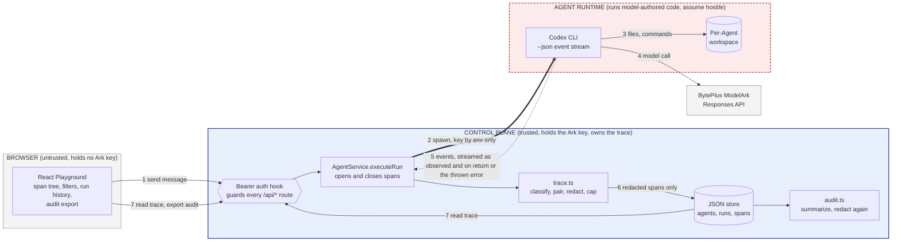

# One-page architecture: Glass Box trace and audit

**Selected track: A — The Glass Box (Trace and Audit).**

Team-designed middleware for the Agent Launchpad. Data flow is numbered;
**trust boundaries are the boxes**; the instrumentation, enforcement, and
recovery points are tabulated below.



## Instrumentation, enforcement, and recovery points

| # | Point | Owner | What crosses | On failure |
| --- | --- | --- | --- | --- |
| 1 | **Auth enforcement** | `app.ts` `onRequest` hook | Bearer token, constant-time compared | 401 before any handler runs, including both trace routes. |
| 2 | **Root and process spans opened** | `AgentService.executeRun` | Spans persisted as `running` *before* the Runtime is invoked | A Run in flight is already observable, and a crashed Run keeps its evidence. |
| 3 | Workspace side effects | Codex, inside the Runtime | File writes, command execution | Contained to the per-Agent workspace bind mount. |
| 4 | **Secret containment** | `childEnvironment()` in both runners | `ARK_API_KEY` as an environment variable | The key is never an argv, a request body, or a span attribute. |
| 5 | **Instrumentation seam** | `RunnerRequest.onEvent`, then `RunnerResult.events` / `RunnerExecutionError.events` | Raw Codex JSON events, streamed as observed and again as a whole list | A failed *or cancelled* run still carries its events, because `RunCancelledError extends RunnerExecutionError`. |
| 5b | **Live span writes** | `LiveTraceWriter` + a serialised write queue | Open spans while the Run executes, closed in place on completion | Live writes are drained before the terminal rewrite, and a failed live write never fails the Run it describes. |
| 6 | **Redaction, classification, retention** | `trace.ts` | Only redacted, capped spans reach disk | Secrets replaced and payloads truncated *before* persistence; `item.started`/`item.completed` paired into one span with a real duration. |
| 7 | **Read and export path** | `GET /api/runs/:id/trace`, `GET /api/runs/:id/audit` | Redacted spans; versioned evidence bundle, priced at the configured rates | Export re-applies redaction at serialization time as defence in depth; the browser re-reads this route until the Run is terminal. |
| — | **Crash recovery** | `AgentService.initialize()` | — | On restart, orphaned Runs are cancelled **and** every span still `running` is closed with a computed duration and a restart reason. |
| — | **Deletion policy** | `AgentService.deleteAgent()` | — | Spans are removed with the Agent's runs and messages, matching workspace archival. |

## Trust boundaries

- **Browser to control plane.** The browser holds no provider credential. Every
  `/api/*` call, including trace reads and audit export, passes the bearer hook
  first.
- **Control plane to Agent Runtime.** The sharpest boundary. Codex executes
  model-authored code, so the Runtime is treated as hostile: non-root, dropped
  capabilities, `no-new-privileges`, CPU/memory/PID caps, and a workspace bind
  mount. The Ark key enters as an environment variable and never comes back
  out; events cross this boundary as plain stdout JSON.
- **Redaction sits inside the boundary, before storage.** Spans are redacted
  where they are constructed, not on the way out, so a secret is never written
  to disk in the first place. The export path redacts a second time because a
  bundle is meant to leave the machine.

## Span model

One Run produces one tree. The root opens before the Runtime is invoked and
closes in the same transaction that transitions `AgentRun.status`.

```
run.orchestration        orchestration    running -> ok | error | cancelled
`- runtime.container     runtime.process  sandbox mode, engine, token usage
   |- model.reasoning    one Codex item
   |- policy.decision    what the platform allowed or denied, actorType system
   |- tool.call          item.started paired with item.completed,
   |- tool.call          carrying the real step duration
   |- runtime.warning    known non-fatal diagnostic, or an item that never completed
   `- runtime.error      the failing step
```

Event spans are written twice: live and open while the Run executes, then
replaced by the authoritative set when it ends.

Problem statement, demo script, evidence map, and limitations:
[GLASS_BOX.md](GLASS_BOX.md).
