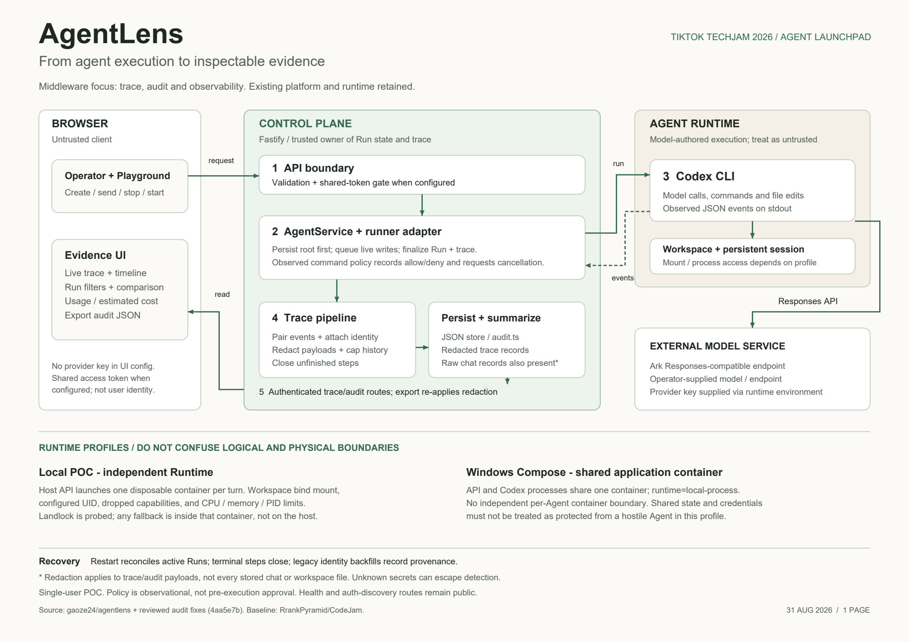

# AgentLens - one-page architecture

Challenge: **Agent Launchpad: Design and Build Lightweight Agent Middleware**.
Team-designed middleware: trace, audit and observability (Glass Box).

- [One-page PDF for submission](../output/pdf/agentlens-architecture.pdf)
- [Vector SVG](assets/agentlens-architecture.svg)
- [PNG for the submission gallery](assets/agentlens-architecture.png)
- [Reproduction and shutdown instructions](RUNBOOK.md)

## Read the numbered flow

1. **API boundary:** the browser sends a task; Fastify validates it and applies shared-token authentication when configured. Health/auth-discovery endpoints are public. This is not user identity or per-user authorization.
2. **Control-plane ownership:** `AgentService.executeRun` persists the root before invoking a runner. It owns lifecycle transitions, live-write ordering and final trace persistence. Observed command policy records allow/deny decisions and requests runner cancellation on denial.
3. **Execution:** Codex calls the configured Ark Responses-compatible endpoint and performs workspace actions. Its event stream crosses back into the control plane as untrusted runtime output.
4. **Instrumentation and storage:** `trace.ts` pairs events, attaches identifiers, sanitizes payloads, and bounds history. `audit.ts` summarizes the trace and reported usage. The JSON store also contains ordinary conversation records; those records and workspace files are not all sanitized by the trace redactor.
5. **Evidence:** the UI reads stored trace/audit records, renders the timeline and comparisons, and exports versioned JSON. Export re-applies redaction. The independent verifier checks the artifact rather than relying on UI appearance.

## Trust and failure boundaries

- **Local POC (`npm run poc`):** the API runs on the host and creates a disposable runtime container per turn. The runtime mounts the Agent workspace and Codex state, with configured UID/resource limits and reduced privileges. This is still ordinary container isolation, not a hardened multi-tenant security guarantee.
- **Windows Compose:** the API and Codex processes share one application container. `RUNTIME_PROVIDER=local-process` refers to a process inside that container. Do not draw or claim a separate per-Agent container boundary for this deployment.
- **Provider credentials:** supplied to the backend/runtime environment, not the browser configuration. The runtime can access its environment; redaction is not a guarantee against deliberate exfiltration or every unknown secret shape.
- **Interruption and upgrade:** startup reconciles active Runs; unfinished terminal spans are closed at the recorded Run end. Missing historical identities are backfilled once and explicitly labelled, without substituting the Agent's current version/session.
- **Policy limitation:** event-driven command matching detects then attempts to terminate; it does not authorize a command before execution. Process cancellation in Compose is not a universal descendant-process cleanup guarantee.

The diagram is generated by `scripts/render-architecture.py` using ReportLab and pypdfium2 (documentation-only dependencies, not required to run the app). The generated PDF is a single landscape page.

Design detail and regression evidence: [GLASS_BOX.md](GLASS_BOX.md). Baseline attribution: [RrankPyramid/CodeJam](https://github.com/RrankPyramid/CodeJam).
