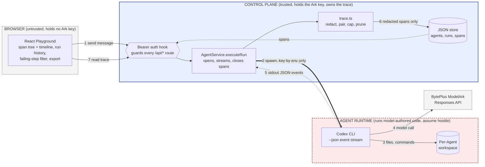

# One-page architecture: Glass Box trace and audit

Team-designed middleware for the Agent Launchpad. Data flow is numbered;
**trust boundaries are the boxes**; the instrumentation, enforcement, and
recovery points are marked 1-7 and tabulated below.



## Instrumentation, enforcement, and recovery points

| # | Point | Owner | What crosses | On failure |
| --- | --- | --- | --- | --- |
| 1 | **Auth enforcement** | `app.ts` `onRequest` hook | Bearer token, constant-time compared | 401 before any handler runs. Applies to the trace read path too. |
| 2 | **Root + process span opened** | `AgentService.executeRun` | Span written as `running` *before* the Runtime is invoked | A Run can never reach a terminal state with no trace. |
| 3 | Workspace side effects | Codex, inside the Runtime | File writes, command execution | Contained to the per-Agent workspace bind mount. |
| 4 | **Secret containment** | Both runners' `childEnvironment()` | `ARK_API_KEY` as an environment variable | The key is never an argv, never a request body, never a span attribute. |
| 5 | **Instrumentation seam** | `RunnerRequest.onEvent` | Raw Codex JSON events, as observed | The control plane records them itself; a runner cannot erase a trace by reporting none. |
| 6 | **Redaction + retention enforcement** | `trace.ts` | Only redacted, capped spans reach disk | Configured secrets, credential shapes, and oversized payloads are replaced *before* persistence. |
| 7 | **Trace read path** | `GET /api/runs/:id/trace` | Redacted spans | Behind the same auth hook as every other route; 404 for an unknown Run. |
| — | **Crash recovery** | `AgentService.initialize()` | — | On restart, orphaned Runs are cancelled **and** every span still `running` is closed, so an interrupted Run stays readable. |

## Trust boundaries

- **Browser → control plane.** The browser holds no provider credential. Every
  `/api/*` call, including the trace read, passes the bearer hook first.
- **Control plane → Agent Runtime.** The sharpest boundary. Codex executes
  model-authored code, so the Runtime is treated as hostile: non-root, dropped
  capabilities, `no-new-privileges`, CPU/memory/PID caps, and a workspace bind
  mount. The Ark key enters as an environment variable and never comes back
  out — events cross this boundary as plain stdout JSON.
- **Redaction is inside the trust boundary, before storage.** Spans are
  redacted where they are constructed, not on the way out to the browser, so a
  secret is never written to disk in the first place.

## Span model

One Run produces one tree. The root is opened at acceptance and closed in the
same transaction that transitions `AgentRun.status`.

```
run.orchestration            orchestration   running → ok | error | cancelled
└─ runtime.container         runtime.process sandbox mode, engine, token usage
   ├─ model.reasoning        one Codex item
   ├─ tool.call              item.started opens it → item.completed closes it
   ├─ tool.call              with a real duration
   └─ runtime.error          the failing step
```

Full design, demo script, evidence map, and limitations:
[GLASS_BOX.md](GLASS_BOX.md).
